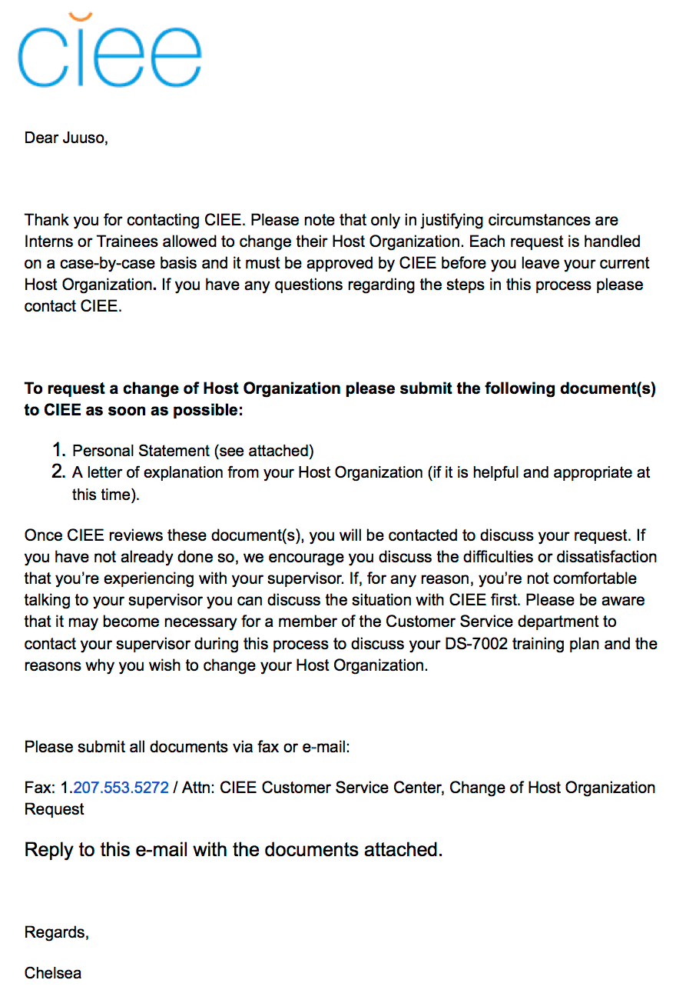
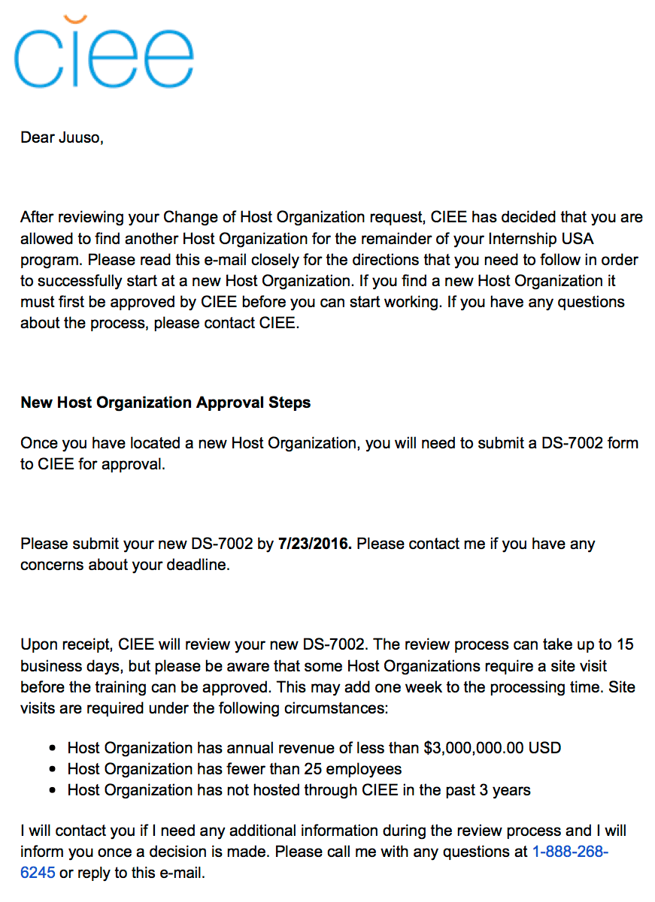

# J1 Host Company Transfer Process

*Disclaimer: The following article is written for the participants of Startuplifers, a Finnish internship program, thus the advice might not be generally applicable for J1 transfers.*

For Startuplifers anything is possible. Sometimes you see a happy kitten looking at you while commuting, sometimes you run into Zuckerberg while jogging around Palo Alto, and sometimes you face problems so bad that you are ready to quit your internship.

That all happened to me!

Although, in this blog post we are going to concentrate on the last thing mentioned. Should you face problems with your internship, you will have two options: quit and go back home or transfer your visa to a new host company. While quitting is straightforward, transferring a J1 visa includes some steps which are hard to find about online.

There is also false information online stating that the J1's would not be transferable. That is false, but more about that later.

## Heavy reason for change

J1 transfers are handled case-by-case. Thus, a transfer is only accepted when a heavy reason for change is involved. This has to be something concrete, easy to articulate, and involve no jargon -- CIEE will deny transfers build around better snacks or CI offerings at a competitive firm.

Ideally, the heavy reason for change is something beyond your control, such as the company's inability to follow the agreed training plan. CIEE says other reasons are also accepted, but the general rule is that when you are in no position to fix the problem and talking about it with your manager isn't fruitful, the transfer should be a clear case.

If that's the case, we can move into the migration process!

## Migration process

The transfer process is roughly the following:

 1. Get your current host company's agreement on transferring over
 2. Contact your visa sponsor with a heavy reason for change
 3. Have your new host company fill a new training plan
 4. Wait for CIEE to approve your new training plan

My timeline of the process was as such:

* **Jun 4**: I reach for a new employer about an internship position. Neither my employer or CIEE are aware that I am looking to change my host company.
* **Jun 14**: I receive an offer letter from the new company and sign it.
* **Jun 15**: I break the news of quitting to my employer. I call CIEE and tell them that I am changing my host company. I receive, fill and send the Personal Statement document.
* **Jun 23**: I receive an email from CIEE verifying that the transfer has been approved by my host company.[^1]
* **Jun 27**: My new host company signs the new training plan.
* **Jul 05**: CIEE approves the new training plan. I start working for the new host company.

Before diving into the specifics of each step, I would bold out the significance of having a job offer lined up. The hardest part of the visa transfer is not the process, but the work and effort required to find a new host company. Once you have quit you will have 30 days of time to find a new host company. If you do not, the rumor has it you will be deported and have your visa obliterated.

So for that reason, it is far less strenuous to find the company beforehand, while you are still making income and don't need to worry about deportation.

## Agreement of transferring over

](./img/transfer.png)

Simply put, as long as you keep on doing the same field of work (eg. software engineering) and the change is fine for CIEE, your current employer, and to-be employer, then you can change your host company.

Once you have a new job offer lined up, the best way to start the transfer process is to first talk to your internship supervisor. Have them agree that the best option for both you and the company is that you change your host company. Getting this talk out of the way will make the rest of the process swift.

The agreement on transferring over can be verbal. I handled this by booking a meeting with my program manager and telling him I would like to quit. Once that was said, I continued to tell how I would like to continue my internship in the States by transferring my visa to a different company. Then I continued by explaining my heavy reason of change.

My program manager was cooperative and agreed that I will call CIEE right after the meeting to start the transfer process. Should your program manager not cooperate, I would contact CIEE and explain the current situation regardless. CIEE should be able to make transfer even if your host company is not cooperative, but I would imagine the transfer to be less efficient in such case.

In my case, we happened to agree on the last day of employment during the meeting, which was set to be 9 days from the day of that meeting. Agreeing on the date was a good idea as it was asked by CIEE on the phone.

The last day of employment will also be the day CIEE calls your employer to verify they are okay with the visa transfer. Therefore, one could hasten the transfer process by agreeing the last day of employment to be the same day of resignation. I preferred the less dramatic schedule, as even in the US, it is good customs to give your employer two weeks notice for a resignation.

## Personal Statement

Once you have informed your employer you are quitting, call CIEE. CIEE will prompt you for the heavy reason of change and the last day of your employment.

If you sound convincing enough, a CIEE representative will follow up momentarily (in my case 15 minutes) with an email. The email will include to-be-filled document as an attachment, called *Personal Statement document*.

)](img/Personal-Statement-for-Change-of-Host-Organization.png)

I was told on the phone to write everything I just told them on the *Personal Statement document*.[^2] I did not file a letter of explanation from my host company nor was there a separate attachment for it in the email.

After you reply to the said email with the document(s) attached (or fax them 🤔) your transfer process is officially started. You are then left to wait for CIEE to call your employer by the last day of your employment.

Grab a beer. You have deserved it.

## Filling the new training plan

Filling the new training plan is no different to what it was when you filled it in Finland the first time. Most likely the process will be faster because no lawyers or travel agencies will be involved.

Once CIEE has called your host company and verified that you are good to leave, you will receive a request during the same day by email to fulfill a new training plan with your new employer (separate image from the one above). Log in to the portal and invite your new host company manager. Once filled and signed by both you and your employer, the DS-7002 will go to CIEE for approval.

If your new employer has not been screened by CIEE, it will add a few days into the process. Otherwise, the training plan may be accepted the same day it was received.

Once the training plan is accepted, you can legally start working for your new employer.

## Notes

The change of host company is free of charge and does not involve changes to your DS-2019.

You can travel within, exit, and re-enter the United States with your old DS-2019, even if it has no information of your new employer on it.

As noted in the letter of approval, CIEE will visit your new employer's office unless your employer has not already had an intern working for them through CIEE. This prolongs the transfer process by extra 1-3 days.

You may have noticed that the wording in one of the emails say that I would have contacted CIEE before finding a new employer and telling my old one I'm about to quit. That is a false. It is just part of their email layout. I initiated the transfer process with CIEE **after** I had found a new employer and told my current one I'm about to quit. I recommend doing the same as it will help you stand strong when going through the talks about quitting.

I once talked with a CIEE staff member who reviews these applications. She noted that oftentimes, people seek advisory from their native program managers, eg. Kilroy/Startuplifers. She reminded that in case you run into problems while in the States, CIEE should be your first line of contact. Kilroy and Startuplifers program coordinators have little power to help you from abroad, even if they would like to.

Finally, my thanks go to the supportive Startuplifers alumni at San Francisco. When I thought that nothing good can come out from the Startuplifers experience anymore, they dragged me up from the ditch, so to say, and convinced me to apply for a transfer. I thank them for that, as the people I met and the experiences I had after my transfer turned out to be very valuable.

[^1]: It is worth mentioning that my application was stuck between Jun 23 and 27 because CIEE sent someone to visit the new host company.

[^2]: As for the filled document, I am happy to share it with any Startuplifers! Feel free to contact me about it.
