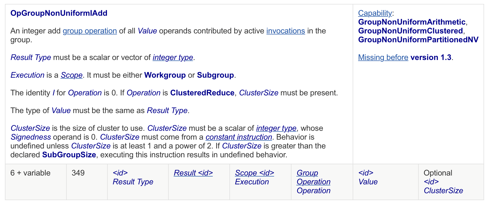
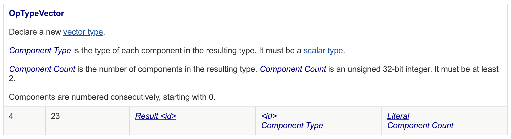

# Vulkan sum reduction

I started working on GPU languages in 2020 when I translated scikit random forest prediction algorithm to APL and then to SPIR-V. This work was part of [my master thesis](https://hal.inria.fr/hal-03155647/) at Inria. In the thesis, I used Vulkan for network packet processing. The approach was much motivated by the [co-dfns](https://github.com/Co-dfns/Co-dfns) project. My thesis work also resulted in writing a Vulkan compute "engine" in Rust called [rivi-loader](https://github.com/periferia-labs/rivi-loader).

Coincidentally, [a series of blog posts](https://raphlinus.github.io/gpu/2020/04/30/prefix-sum.html) by Raph Levien appeared which echoed the motivation of my approach:

> Today, there are two main ways to run compute workloads on GPU. One is CUDA, which has a fantastic ecosystem including highly tuned libraries, but is (in practice) tied to Nvidia hardware. The other is graphics APIs used primarily for gaming, which run on a wide variety of hardware, but historically offer much less power than CUDA. Also, the tooling for compute in that space is terrible. Historically, a lot of compute has also been done with OpenCL, but its future is cloudy as it’s been officially deprecated by Apple, and GPU vendors are not consistently keeping their OpenCL implementations up to date.
>
> Vulkan has been catching up fast in its raw capabilities, with recent extensions supporting more advanced GPU compute features such as subgroups, pointers, and a memory model. Is it getting to the point where it can run serious compute workloads?

In my thesis work I was able to use the so-called variable pointers, but it took me several years to find myself an excuse to make use of subgroups. As such, this post is about describing how to do subgroup-powered sum reduction in Vulkan compute, using raw SPIR-V.

## Sum reduction on scalar values

In APL, sum reduction is coded as `+/⍵`. That is, suppose `⍵` is a vector $v$, then we do an operation

$\sum{v}$

Efficient use of GPUs requires divide-and-conquer algorithms. This is because a GPU shader is launched with an invocation matrix $I_M$ such that $[x,y,z]$. For example, $I_M = [64,1,1] \implies \sum I = x * y * z$.

First, let us consider a _common practice_ when dealing with vectors. With vector $v$ of length $64$ and $I_M = [64,1,1]$ we have $v[i] = I_{M[x,1,1]}$. E.g., with vector $v = \{1,2,3..64\}$ accessing $I[5]$ gives us $v[5] = 6$ (indexing starts at $0$).

Each $I$ is divided into partitions within subgroups (in CUDA terms, _warps_) $S$ where $s \subseteq S$. Suppose the same vector $v$ with length $64$ and subgroup size $\bar{s}$ is $32$. Then, $\sum S = \frac{v}{\bar{s}}$. Coincidentally, this implies that subgroup  $s_i$ has elements from $v[s_i+32]$. To elaborate:

$s_0 = v[0..31]$
$s_1 = v[32..63]$

Subgroups also have other properties. These are: `SubgroupSize` ($\bar{s}$), `SubgroupId` ($s_i$), and `SubgroupLocalInvocationId` (denoted subsequently as $s^j$). As such, if we want to target element $v_i$ which has the value of $1$, we find this from $s_0^0$. Similarly, $s_1^0$ would yield $v[32] = 33$.

The hard part of writing algorithms in a parallel settings is that the source code of the program denotes to a view of a single $I$, not the view of $\sum I$. Further, at runtime there is no way of evaluating $\sum I$. In other words, if we pass our vector $v$ into a program with source code $v + 1$, what will happen is that the program yields us $v = \{2,3,4..65\}$. In other words, while the operation $v + 1$ is only written once, it will happen for $\sum I$ times, which in our example happens to correspond to $\bar{v}$.

If we want to write a sum reduction in this paradigm, then the programming will become less trivial. In pseudocode, we _could_ write:

```html
this = v[I]
match I == 0
    true => {
        range val in (length v) {
            this += val
        }
    },
    false => {} // i.e., sleep
}
```

While we will eventually get the sum of $v$ in location $I[0]$, this is non-optimal, because we sleep on $I[1..63]$ while $I[0]$ does all the work!

But, we can get away with more productive approach. This is where subgroups become into play. As each subgroup handles a range of values from $v$, we can command the whole range instead of a single element. In SPIR-V, what operations are available for subgroups is documented under the section called _[Non-Uniform Instructions](https://www.khronos.org/registry/SPIR-V/specs/unified1/SPIRV.html#_non_uniform_instructions)_. From here, we can find that the operations such as `OpGroupNonUniformIAdd` exist. Now, consider the following pseudocode:

```s
v[I] = OpGroupNonUniformIAdd Reduce v[I]
```

Now, $I[0..31]$ will hold $\sum s_0$ and $I[32..63]$ will hold $\sum s_1$. This evaluates to $v[0..31]$ now holding $528$ and $v[32..63]$ holding $1552$. What we now need to do is to synchronize the values from each subgroup. This can be achieved with the following logic:

if $(s^j = 0) \implies v[s_i] = v[I]$
else $v[I] = 0$

Where $v[I]$ is the current $I$ value. This will move $\sum s_0$ to $v[0]$ and $\sum s_1$ to $v[1]$ while clearing any other $v[i]$ to $0$. So, now, $v[0] = 528$ and $v[1] = 1552$, and $v[2..63] = 0$ (it is worth noting that clearing to zero is effectively free for us, since the other $I$'s would be sleeping otherwise anyway).  Followed by new subgroup reduction with the same synchronization logic, we get $v[0] = 2080$ while $v[i \setminus 0] = 0$.

In pseudocode we have done the following:

```python
reduce(v)
iter = (len v) / SubgroupSize
while iter > 1
    sync
    reduce(v)
    iter--
```

This achieves sum reduction up to $\bar{v} = 1024$ while using only two (subgroup) sum operations. This is more efficient than the naive sum reduction on an $I$, but it does still leave optimizations on the table.

## Sum reduction on vector values

Above we mentioned it is _common practice_ to assign each $I_{M[x,1,1]}$ to each of $v[i]$. However, this is not a strict requirement. In fact, we see from the semantics of the group operation the following on _Result Type_:



In SPIR-V, a vector is defined as follows:



From further consultation of the [SPIR-V specification](https://www.khronos.org/registry/SPIR-V/specs/unified1/SPIRV.html) we can find that vectors are limited to length of $4$. This coincidentally means that we are leaving $4x$ performance on the table!

To use vectors, we need to redefine that each $I$ loads a value from $v$ with an `ArrayStride` of $16$ (the scalar stride being $4$). After this change, each $I$ will load $v[i..i+3]$ into its memory. Accessing $I[0]$ will, as such, give us $\{1,2,3,4\}$. If we then increase $\bar{v}$ to $128$ and run the subgroup sum reduction, we will find that $I[0]$ will now hold values according the following formula: $\{\sum s_i[0], \sum s_i[1], \sum s_i[2], \sum s_i[3]\}$. In our example, this corresponds to $\{2016, 2048, 2080, 2112\}$.

The problem now is that we need our scalar sum reduction to sum these values again. We can do this with subgroups again, using the code from the previous chapter. We must change our pseudocode to as follows:

```python
reduce(v as vector4)
iter = (len v) / SubgroupSize
while iter > 1
    sync
    reduce(v as vector4)
    iter--
reduce(v as scalar)
```

Running the scalar reduction will yield us $v[0] = \{8256, 0, 0, 0\}$, while subsequently holding that $v[i \setminus 0] = \{0,0,0,0\}$. Effectively, we are able to sum reduce up to $\bar{v} = 4096$ while needing only three subgroup add operations.

## Remarks

In our pseudocode, we call `(len v)` although we made a remark earlier that $\sum I$ cannot be known. This is true, but there are two cases in which we know $\bar{v}$ instead. These cases are:

1. The input array is of type [OpTypeRuntimeArray]( https://www.khronos.org/registry/SPIR-V/specs/unified1/SPIRV.html#OpTypeRuntimeArray) which allows us to call [OpArrayLength]( https://www.khronos.org/registry/SPIR-V/specs/unified1/SPIRV.html#OpArrayLength).
2. The input length is statically known. In this case, we can pass in the whole `iter` variable as either specialization constant, push constant, or some other form of uniform memory. The problem might be that for program compositions, evaluating the size of each subsequent phase might be tricky, but in most cases decidable (counterexample being, e.g., any phase following the filter function).

SPIR-V also supports matrix data structures up to the size of $4x4$. This would in theory allow us to work with $\bar{v} = 16 384$, but at least for reduce this is not the case.

The constraint of $1024$ and $4096$ come from the fact that beyond this the subgroup indices are located in a different "workgroup". We would need a new synchronization logic for every time that we are done with a given workgroup. I may update this post once I get around doing so.

What happens if you use vector $4$ for an input size that is not divisable by $4$? You could use some other vector type instead and fallback to scalar operations if nothing else is possible. This would require either specialization constants to be used or compiler phase to retrofit the current SPIR-V compute shader. In general, the same applies when the type of your result changes, e.g., when you use a scalar or a float.

## Conclusion

In this post we described how we can do sum reduction using SPIR-V subgroups up to vector length of $4096$. With SPIR-V, we are able to run this program on GPUs of different manufacturers using the Vulkan GPU API. As Vulkan is supported by Nvidia, AMD, and, e.g., Apple ARM among others, this allows us to build cross-compatible array operations similar to CUDA.

In general, programming GPU is tricky even for simple array operations, and while languages to do so are restrictive, the languages _do_ exist. But, if we want to compete with CUDA, we are facing with a huge sunk cost of optimizing SPIR-V kernels, possibly by hand.

For more GPU stuff, you can [follow me on Twitter](https://twitter.com/osnnr), you can stargaze [rivi-loader](https://github.com/periferia-labs/rivi-loader) on Github, and amaze at the spaghetti of the final SPIR-V assembly code on the [rivi-std repository](https://github.com/periferia-labs/rivi-std/blob/main/src/spirv/reduce/reduce.s), and even run the program using the [rivi-std example](https://github.com/periferia-labs/rivi-std/blob/main/examples/reduce.rs) (requires Vulkan installation which is a topic in itself, but do consult documentation on [ash](https://github.com/MaikKlein/ash)).

For every error found in this post, I will post a new array operation. Stay tuned!
